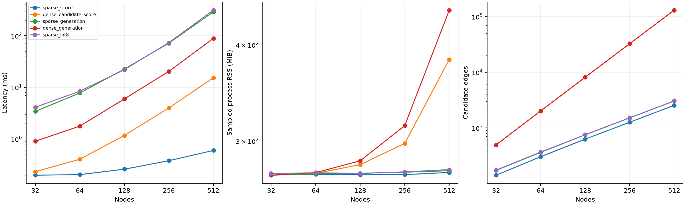

# Comparing Dense and Sparse Graph Generation

PyTorch experiments on sparse graph generation with connectivity, edge-budget and optional degree constraints.

## Results

The main study trained 9 models across three seeds and evaluated 2,880 generated graphs on conditioned SBMs and planar graphs with 32 nodes and 64 edges.

All generated outputs satisfied their requested connectivity, edge-budget and degree constraints.

At 512 nodes, using one CPU thread, four generation steps and batch size one:

| Measurement | Dense | Sparse |
|---|---:|---:|
| Complete generation, median ms | 88.22 | 288.89 |
| Sampled process RSS, MiB | 443.64 | 274.47 |

Sparse generation used 38.1% less process memory, but was 3.27× slower overall. Candidate scoring alone was 25.4× faster with the same sparse model weights, showing that constraint handling dominates total runtime.



Sparse models had worse clustering fidelity than dense diffusion, and none of the generators produced planar graphs. Models were trained at 32 nodes. Larger sizes are used only for inference-scaling experiments.

[Detailed results](docs/RESULTS.md) · [Methods](docs/METHODS.md) · [Quality](figures/research/quality.png) · [Moving agents](figures/research/dynamic.png)

## Quick start

Use Python 3.12 from the repository root:

```bash
python -m venv .venv
source .venv/bin/activate
python -m pip install -r requirements.txt
python -m pip install --no-deps --no-build-isolation -e .
```

Generate graphs from the saved sparse model:

```bash
python -m frugal_graphs.research sample --nodes 32 --budget 64 --degree-cap 6 --output generated/demo
```

Restore and verify the recorded experiment:

```bash
python -m frugal_graphs.research restore --output generated/recorded
python -m frugal_graphs.research verify --output generated/recorded
```

Run the tests and a short experiment:

```bash
python -m pytest -q
python -m frugal_graphs.research run --smoke --output generated/smoke
python -m frugal_graphs.research verify --output generated/smoke
```

Full experiment settings and seeds are available in [configs/research.json](configs/research.json).

## License

[MIT](LICENSE). Copyright © 2026 Alexandre Autran.
